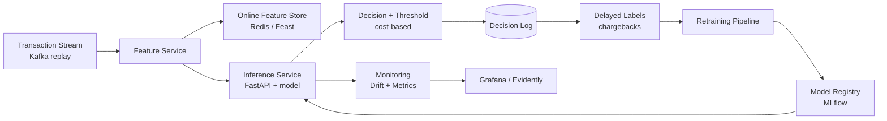

# Real-Time Fraud Detection Service

A production-grade ML system for scoring card transactions in real time. The goal
of this repository is to demonstrate **senior ML engineering** maturity — shipping,
scaling, monitoring and maintaining ML in production — not just training a model in
a notebook.

> **Core thesis:** the hard parts of fraud detection are MLOps, reliability,
> monitoring, cost and business impact — not model accuracy alone.

---

## Why fraud detection

Fraud detection forces every hard production constraint at once:

- **Hard latency SLA** — score in <50 ms while the transaction is pending.
- **Extreme class imbalance** — fraud is ~0.1–1% of transactions.
- **Delayed, noisy labels** — chargebacks arrive weeks later.
- **Concept drift** — fraudsters adapt continuously.
- **Asymmetric costs** — a false negative costs the fraud amount; a false positive costs a customer.

**The story:** *a system that scores transactions in real time, monitors itself,
retrains on delayed labels, and tunes its decision threshold by business cost — not by F1.*

---

## Project status

This repository is built in phases. Each phase is delivered on its own branch and PR.

| Phase | Deliverable | Status |
|---|---|---|
| **0. Foundations** | Repo, config, data layer, EDA, dummy + logistic baselines, Docker, CI | ✅ this PR |
| **0.5 Model bake-off** | Multi-model tournament, time-based split, calibration, cost-based threshold, MLflow leaderboard | ⏭ next |
| 1. Serving | FastAPI inference, latency benchmark | planned |
| 2. Features | Feast + Redis online store, offline/online parity | planned |
| 3. Streaming | Kafka replay → live scoring | planned |
| 4. Monitoring | Evidently drift + Prometheus/Grafana | planned |

---

## Architecture (target)



---

## Quick start

### Option A — local Python (one command each)

```bash
python -m venv .venv && source .venv/bin/activate
pip install -e '.[ml,dev]'

fraud-data        # build the dataset (synthetic by default, no credentials)
fraud-eda         # write EDA figures to reports/figures/
fraud-baseline    # train the dummy + logistic baselines and print metrics
pytest -q         # run the test suite
```

### Option B — Docker (no local Python needed)

```bash
docker compose run --rm pipeline   # data -> EDA -> baselines
docker compose run --rm tests      # pytest
```

`make help` lists all developer shortcuts.

---

## Data strategy

The repository ships a **self-contained synthetic generator** as the default
backend, so it runs in one command with **zero credentials** and is reproducible
in CI. The generator produces realistic, timestamped transactions with genuine
learnable signal, configurable fraud rate, per-card velocity features, and
**delayed labels** (simulated chargebacks) — everything the later phases need.

A **Kaggle backend** is included for realism. Switch with `FRAUD_DATA_SOURCE=kaggle`:

| Dataset | Role |
|---|---|
| **Sparkov** (`kartik2112/fraud-detection`) | Default Kaggle source — timestamps + geolocation, replayable as a stream. |
| **IEEE-CIS** | Rich competition data (set `FRAUD_KAGGLE_COMPETITION=ieee-fraud-detection`; accept the rules first). |

**To use Kaggle data:**

1. `pip install -e '.[kaggle]'`
2. Create an API token at <https://www.kaggle.com/settings> → *Create New API Token*,
   save `kaggle.json` to `~/.kaggle/kaggle.json`, then `chmod 600 ~/.kaggle/kaggle.json`.
3. For IEEE-CIS, accept the competition rules on its Kaggle page once.
4. `FRAUD_DATA_SOURCE=kaggle fraud-data`

Both backends emit the **same canonical schema** (`src/fraud_detection/data/schema.py`),
which is what keeps training and serving consistent.

---

## Design decisions & trade-offs

- **Time-based (out-of-time) split, not random.** Fraud drifts, so a random split
  leaks the future and inflates metrics. Train on earlier periods, test on later.
- **Fraud-appropriate metrics.** Accuracy is meaningless at ~1% prevalence. The
  project centres on PR-AUC, recall @ fixed precision, precision @ top-k, Brier
  score, and — above all — a **business cost model**.
- **One shared feature definition.** A single schema + preprocessing pipeline is
  reused everywhere to prevent training/serving skew later.
- **Cost over F1.** The decision threshold is chosen to minimise expected dollar
  loss using an explicit, asymmetric cost matrix (`FRAUD_COST_*`).
- **Synthetic-first data.** Removes credential friction and licensing concerns
  while preserving the structure (imbalance, drift, delayed labels) that makes the
  engineering interesting. Real Kaggle data is one env var away.

---

## Repository layout

```
src/fraud_detection/
  config.py            # typed settings (env / .env overrides)
  metrics.py           # fraud metrics + business cost model
  data/
    schema.py          # canonical transaction schema (single source of truth)
    synthetic.py       # self-contained generator (default backend)
    kaggle_source.py   # optional Kaggle backend (Sparkov / IEEE-CIS)
    loader.py          # unified loader with Parquet caching
    split.py           # time-based train/valid/test split
  eda/profile.py       # EDA figures + summary
  models/
    preprocessing.py   # shared ColumnTransformer
    baseline.py        # dummy + logistic baselines
tests/                 # pytest suite
Dockerfile, docker-compose.yml, Makefile, .github/workflows/ci.yml
```

---

## License

MIT — see `LICENSE`. Kaggle datasets carry their own licenses/competition rules;
review them before any commercial use.