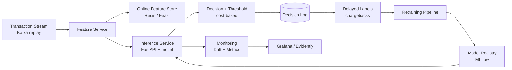

# Real-Time Fraud Detection Service

A production-grade ML system for scoring card transactions in real time. The goal
of this repository is to demonstrate **senior ML engineering** maturity — shipping,
scaling, monitoring and maintaining ML in production — not just training a model in
a notebook.

> **Core thesis:** the hard parts of fraud detection are MLOps, reliability,
> monitoring, cost and business impact — not model accuracy alone.

---

## Why fraud detection

Fraud detection forces every hard production constraint at once:

- **Hard latency SLA** — score in <50 ms while the transaction is pending.
- **Extreme class imbalance** — fraud is ~0.1–1% of transactions.
- **Delayed, noisy labels** — chargebacks arrive weeks later.
- **Concept drift** — fraudsters adapt continuously.
- **Asymmetric costs** — a false negative costs the fraud amount; a false positive costs a customer.

**The story:** *a system that scores transactions in real time, monitors itself,
retrains on delayed labels, and tunes its decision threshold by business cost — not by F1.*

---

## Project status

This repository is built in phases. Each phase is delivered on its own branch and PR.

| Phase | Deliverable | Status |
|---|---|---|
| **0. Foundations** | Repo, config, data layer, EDA, dummy + logistic baselines, Docker, CI | ✅ |
| **0.5 Model bake-off** | Multi-model tournament, time-based split, calibration, cost-based threshold, MLflow leaderboard | ✅ |
| **1. Serving** | FastAPI inference API (`/score`), warm-loaded model bundle, latency benchmark | ✅ |
| 2. Features | Feast + Redis online store, offline/online parity | planned |
| 3. Streaming | Kafka replay → live scoring | planned |
| **4. Monitoring** | PSI drift detection (`fraud-drift`) + Prometheus serving metrics (`/metrics`) | ✅ |

---

## Architecture (target)



---

## Quick start

### Option A — local Python (one command each)

```bash
python -m venv .venv && source .venv/bin/activate
pip install -e '.[ml,dev,serving,monitoring]'

fraud-data        # build the dataset (synthetic by default, no credentials)
fraud-eda         # write EDA figures to reports/figures/
fraud-baseline    # train the dummy + logistic baselines and print metrics
fraud-bakeoff     # run the Phase 0.5 model tournament -> leaderboard + artifacts
fraud-bench       # benchmark serving latency (p50/p95/p99) vs the 50 ms SLA
fraud-serve       # start the inference API at http://localhost:8000 (docs at /docs)
fraud-drift       # compute feature + score drift (PSI); add --inject-drift to see an alert
pytest -q         # run the test suite
```

### Option B — Docker (no local Python needed)

```bash
docker compose run --rm pipeline   # data -> EDA -> baselines
docker compose run --rm bakeoff    # the model tournament
docker compose run --rm tests      # pytest
docker compose up mlflow           # MLflow UI at http://localhost:5000
docker compose up serving          # inference API at http://localhost:8000
```

`make help` lists all developer shortcuts.

---

## Data strategy

The repository ships a **self-contained synthetic generator** as the default
backend, so it runs in one command with **zero credentials** and is reproducible
in CI. The generator produces realistic, timestamped transactions with genuine
learnable signal, configurable fraud rate, per-card velocity features, and
**delayed labels** (simulated chargebacks) — everything the later phases need.

A **Kaggle backend** is included for realism. Switch with `FRAUD_DATA_SOURCE=kaggle`:

| Dataset | Role |
|---|---|
| **Sparkov** (`kartik2112/fraud-detection`) | Default Kaggle source — timestamps + geolocation, replayable as a stream. |
| **IEEE-CIS** | Rich competition data (set `FRAUD_KAGGLE_COMPETITION=ieee-fraud-detection`; accept the rules first). |

**To use Kaggle data:**

1. `pip install -e '.[kaggle]'`
2. Create an API token at <https://www.kaggle.com/settings> → *Create New API Token*,
   save `kaggle.json` to `~/.kaggle/kaggle.json`, then `chmod 600 ~/.kaggle/kaggle.json`.
3. For IEEE-CIS, accept the competition rules on its Kaggle page once.
4. `FRAUD_DATA_SOURCE=kaggle fraud-data`

Both backends emit the **same canonical schema** (`src/fraud_detection/data/schema.py`),
which is what keeps training and serving consistent.

---

## Phase 0.5 — model bake-off

`fraud-bakeoff` runs a fair, evidence-backed tournament across six candidates
(dummy, logistic regression, random forest, XGBoost, LightGBM, CatBoost) and
produces a leaderboard plus the artifacts that justify the final pick.

**Decision rule (stated upfront):** *pick the model that minimises expected
business cost per transaction at the operating threshold, **subject to p99
latency < 50 ms.***

### Methodology

1. **Time-based out-of-time split** — train on the past, validate on the middle,
   test on the future. No random shuffling, so no future leakage.
2. **Imbalance handled per-model** — class weights / `scale_pos_weight`, not
   assumed. The comparison reflects tuned-for-imbalance behaviour.
3. **Optional Optuna tuning** (`--tune`) — equal, small trial budget per model
   for an apples-to-apples comparison, optimising PR-AUC on validation.
4. **Calibration comparison** — raw vs Platt (sigmoid) vs isotonic. Calibrators
   are fit on one half of validation and **selected by Brier on an independent
   half**, then refit and applied to test. Isotonic is only offered when there
   are enough positives to support it — the data decides.
5. **Cost-based threshold** — chosen on validation by minimising expected dollar
   cost, then reported on test (no threshold leakage).
6. **Latency** — single-row p50/p99 measured on the fitted pipeline.
7. **Everything logged to MLflow** — one experiment, one run per model.

### Metrics — fraud-appropriate, not accuracy

PR-AUC (primary), ROC-AUC, recall @ 90% precision, precision @ top-1%, Brier
score (raw and calibrated), expected **cost per transaction**, and **p50/p99
latency**.

### Example leaderboard (synthetic data, 120k transactions)

| model | pr_auc | roc_auc | brier_raw | brier_cal | calibration | cost/txn | p50 ms | p99 ms | meets SLA |
|---|---:|---:|---:|---:|---|---:|---:|---:|:--:|
| **logistic_regression** | 0.077 | 0.787 | 0.173 | 0.011 | sigmoid | **0.774** | 1.5 | 2.9 | ✅ |
| catboost | 0.057 | 0.727 | 0.090 | 0.012 | sigmoid | 0.990 | 1.7 | 3.1 | ✅ |
| lightgbm | 0.039 | 0.701 | 0.024 | 0.012 | sigmoid | 1.013 | 2.4 | 6.7 | ✅ |
| xgboost | 0.049 | 0.728 | 0.058 | 0.012 | sigmoid | 1.014 | 1.8 | 2.7 | ✅ |
| dummy | 0.012 | 0.496 | 0.024 | 0.012 | sigmoid | 1.685 | 1.5 | 2.3 | ✅ |
| random_forest | 0.054 | 0.762 | 0.015 | 0.012 | sigmoid | 0.854 | 29.1 | **62.7** | ❌ |

**Read this result carefully — it is the whole point.** `random_forest` has the
second-lowest cost, but its **p99 of 62.7 ms breaks the SLA**, so it is
disqualified. The winner is the model with the lowest cost *among SLA-compliant
candidates*. A model that wins on cost but blows the latency budget loses — the
decision rule encodes that automatically.

> **Note on synthetic data:** the generator's signal is partly linear, so logistic
> regression is competitive here. On categorical-heavy real data (IEEE-CIS),
> gradient boosters typically win — switch with `FRAUD_DATA_SOURCE=kaggle`. The
> **methodology** (fair tournament, calibration, cost-under-latency rule) is the
> transferable part, not the specific winner.

### Artifacts produced

- `artifacts/leaderboard.md` / `.csv` — the full models × metrics table.
- `artifacts/model_selection_rationale.md` — decision rule + outcome + trade-offs.
- `artifacts/best_model.joblib` — the winning pipeline + calibrator + threshold,
  ready for Phase 1 serving.
- `reports/figures/bakeoff_pr_curves.png` — PR curves overlaid.
- `reports/figures/bakeoff_reliability.png` — calibration before vs after.
- `reports/figures/bakeoff_latency_vs_prauc.png` — the latency/PR-AUC trade-off.
- `reports/figures/bakeoff_cost_curve.png` — cost vs threshold for the winner.

Run `fraud-bakeoff --tune` to add Optuna tuning, or `--quick` for a fast pass.

---

## Phase 1 — serving

The bake-off persists the winner as a self-contained bundle
(`artifacts/best_model.joblib` = preprocessing + model + calibrator + threshold +
feature list). Phase 1 serves it behind a low-latency FastAPI app.

```bash
fraud-serve                      # API at http://localhost:8000  (OpenAPI docs at /docs)
```

| Endpoint | Method | Purpose |
|---|---|---|
| `/health` | GET | Liveness + whether a model is loaded. |
| `/model` | GET | Serving model name, threshold, and feature list. |
| `/score` | POST | Score one transaction → calibrated probability + block/allow decision. |

```bash
curl -s -X POST localhost:8000/score -H 'Content-Type: application/json' -d '{
  "amount": 249.99, "amount_log": 5.525, "hour": 23, "day_of_week": 5,
  "is_night": 1, "is_weekend": 1, "card_age_days": 412.0, "txn_count_1h": 3,
  "txn_count_24h": 8, "amount_mean_24h": 86.40, "amount_to_mean_ratio": 2.894,
  "distance_from_home": 57.21, "merchant_risk": 0.82,
  "category": "electronics", "channel": "online", "device_type": "web" }'
# -> {"probability":0.011,"is_fraud":false,"decision":"allow","threshold":0.033,"model_name":"logistic_regression"}
```

**Design notes:**

- **One scoring path.** The API and the benchmark both call `ModelBundle.score`,
  so what you measure is what you serve (no skew between paths).
- **Warm start.** The bundle is loaded once at startup and kept on `app.state`,
  so requests never touch disk.
- **Contract = schema.** The `/score` request model mirrors
  `schema.feature_columns()` exactly; a test fails if they ever diverge.
- **SLA enforced in the open.** `fraud-bench` reports p50/p95/p99 for single-row
  scoring and checks them against the **50 ms** budget — the same rule the
  bake-off uses to pick the model. Measured locally: **p99 ≈ 2.6 ms**.

```text
=============== SERVING LATENCY ===============
  model        : logistic_regression
  p50 / p95    : 1.8 ms / 2.4 ms
  p99          : 2.6 ms   (SLA < 50 ms)
  meets SLA    : ✅ yes
===============================================
```

---

## Phase 4 — monitoring

A model is only as good as the data it sees *today*. Phase 4 adds two things that
catch a model going stale **before** the delayed fraud labels arrive weeks later.

### 1. Drift detection — `fraud-drift`

[Population Stability Index (PSI)](https://en.wikipedia.org/wiki/Population_stability_index)
measures how far live traffic has moved from the baseline the model knows. It is
computed in pure numpy/pandas — no heavyweight dependency — so the maths is
transparent and CI stays fast.

```bash
fraud-drift                 # older half vs newer half of the data
fraud-drift --inject-drift  # perturb the recent window to see the alert fire
```

It reports a per-feature PSI plus, when a trained bundle is present, the **model
score** PSI (the single most actionable signal — the model's *output* is moving).
Reading follows the industry convention:

| PSI | Meaning | Action |
|---|---|---|
| `< 0.10` | stable | none |
| `0.10 – 0.25` | moderate shift | investigate |
| `≥ 0.25` | major shift | retrain / alert |

The report is written to `artifacts/drift_report.json`, and the command **exits
non-zero on a major alert** so it can gate a scheduled pipeline.

```text
================ DRIFT REPORT ================
  reference rows : 6000
  current rows   : 6000
  max feature PSI: 1.8421
  score PSI      : 0.9123  (major)
  ---------------------------------------------
  feature                      PSI  severity
  amount                    1.8421  major  🚨
  hour                      1.2050  major  🚨
  merchant_risk             0.4133  major  🚨
  ...
  ---------------------------------------------
  🚨 ALERT — major drift detected
==============================================
```

### 2. Live serving metrics — `GET /metrics`

The inference API exposes Prometheus metrics so throughput, latency and the live
score distribution are observable while transactions flow:

| Metric | Type | What it tells you |
|---|---|---|
| `fraud_score_requests_total` | counter | throughput |
| `fraud_decisions_total{decision}` | counter | block vs allow split |
| `fraud_score_latency_seconds` | histogram | latency percentiles vs the 50 ms SLA |
| `fraud_score_probability` | histogram | score distribution — real-time drift signal |

```bash
fraud-serve
curl -s localhost:8000/metrics | grep fraud_
```

Prometheus is an optional dependency (the `monitoring` extra). Without it the API
still runs — `/metrics` simply answers `503`.

---

## Design decisions & trade-offs

- **Time-based (out-of-time) split, not random.** Fraud drifts, so a random split
  leaks the future and inflates metrics. Train on earlier periods, test on later.
- **Fraud-appropriate metrics.** Accuracy is meaningless at ~1% prevalence. The
  project centres on PR-AUC, recall @ fixed precision, precision @ top-k, Brier
  score, and — above all — a **business cost model**.
- **One shared feature definition.** A single schema + preprocessing pipeline is
  reused everywhere to prevent training/serving skew later.
- **Cost over F1.** The decision threshold is chosen to minimise expected dollar
  loss using an explicit, asymmetric cost matrix (`FRAUD_COST_*`).
- **Synthetic-first data.** Removes credential friction and licensing concerns
  while preserving the structure (imbalance, drift, delayed labels) that makes the
  engineering interesting. Real Kaggle data is one env var away.

---

## Repository layout

```
src/fraud_detection/
  config.py            # typed settings (env / .env overrides)
  metrics.py           # fraud metrics + business cost model
  data/
    schema.py          # canonical transaction schema (single source of truth)
    synthetic.py       # self-contained generator (default backend)
    kaggle_source.py   # optional Kaggle backend (Sparkov / IEEE-CIS)
    loader.py          # unified loader with Parquet caching
    split.py           # time-based train/valid/test split
  eda/profile.py       # EDA figures + summary
  models/
    preprocessing.py   # shared ColumnTransformer
    baseline.py        # dummy + logistic baselines
    candidates.py      # bake-off candidate registry (6 models)
    calibration.py     # raw vs sigmoid vs isotonic comparison
    tuning.py          # optional Optuna tuning (equal budget)
  bakeoff/
    runner.py          # tournament orchestrator
    latency.py         # p50/p99 latency measurement
    plots.py           # PR / reliability / latency / cost figures
    cli.py             # `fraud-bakeoff`
  serving/
    bundle.py          # warm-loaded model bundle + single scoring path
    app.py             # FastAPI app (/health, /model, /score, /metrics)
    benchmark.py       # p50/p95/p99 latency probe vs the 50 ms SLA
    cli.py             # `fraud-serve`, `fraud-bench`
  monitoring/
    drift.py           # Population Stability Index (PSI) maths
    report.py          # per-feature + score drift report
    metrics.py         # Prometheus serving metrics (optional dependency)
    cli.py             # `fraud-drift`
tests/                 # pytest suite
Dockerfile, docker-compose.yml, Makefile, .github/workflows/ci.yml
```

---

## License

MIT — see `LICENSE`. Kaggle datasets carry their own licenses/competition rules;
review them before any commercial use.